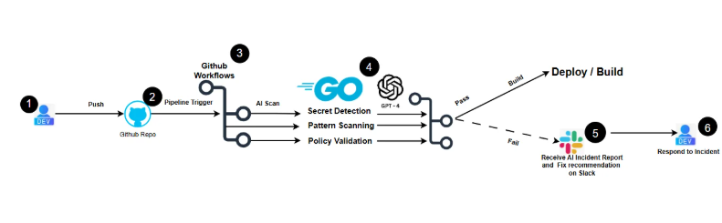

Go CI/CD Security Guardrail
A production-style DevSecOps security guardrail built with Go to enforce secure coding practices directly within CI/CD pipelines.
This project demonstrates how to combine deterministic policy enforcement with automated scanning and real-time alerting to prevent insecure code from reaching production.

 ## Key Capabilities

 Detects hardcoded secrets (API keys, tokens, credentials)
 Policy-as-code enforcement (deterministic validation)
 Fail-closed pipeline (blocks unsafe builds)
 Real-time Slack incident alerts
 Lightweight Go CLI for fast execution in CI/CD
 File-level detection with line-level traceability


## Architecture



## Component Map
ComponentPurposego-guardrail.ymlWorkflow trigger, runner config, concurrency controlscmd/gate/main.goCLI entrypoint — orchestrates scan, formats outputinternal/scannerPolicy loader and pattern matching engineinternal/notifySlack webhook alertingconfigs/policies.jsonPolicy-as-code: patterns, severity, fix guidance
Key Design Decisions
Fail-closed by default — the pipeline blocks on any HIGH or MEDIUM violation; silence is not safety.
Self-exclusion — the scanner excludes its own cmd/ directory to avoid flagging its own detection patterns as violations.
Policy-as-code — all rules live in configs/policies.json, keeping detection logic out of source and making rules auditable as part of the codebase.
Lightweight runtime — a single compiled Go binary with no runtime dependencies, keeping CI execution fast and the attack surface minimal.

## How It Works

Developer pushes code to GitHub
GitHub Actions triggers the pipeline
The Go CLI tool scans the codebase for sensitive patterns
Policy rules are applied to detected patterns
If violations are found:

Build is blocked 
Slack alert is triggered 


If no violations:

Pipeline passes 


 ## Demo Scenario

**Step 1 — Introduce a vulnerability**
Add this to any .go file:
goAPI_KEY = "sk-test-123"

**Step 2 — Push code**
bashgit add .
git commit -m "test security violation"
git push

**Step 3 — Observe behavior**

 Pipeline fails
 Slack alert triggered
 File and line of issue displayed

**Step 4 — Fix the issue**
Remove the hardcoded secret and use an environment variable instead:
goapiKey := os.Getenv("API_KEY")

**Step 5 — Push again**
bashgit commit -am "fix: remove hardcoded secret"
git push
 Result

Pipeline passes
No alerts triggered


 Usage
Build locally
bashgo build -o gate ./cmd/gate
Run scan
bash./gate --config configs/policies.json --path .

 Configuration
Policy file
Located at configs/policies.json. Defines patterns to detect, severity levels, and enforcement rules.
Slack integration
Set your webhook in GitHub Secrets:
SLACK_WEBHOOK_URL

 CI/CD Integration
Full workflow with concurrency control and timeout:
yamlname: Go Security Guardrail

concurrency:
  
  group: ${{ github.workflow }}-${{ github.ref }}
  cancel-in-progress: true

on:
  push:
    branches: ["main"]
  pull_request:

jobs:
  go-security:
    runs-on: ubuntu-latest
    timeout-minutes: 10
    steps:
      - name: Checkout repository
        uses: actions/checkout@v4

      - name: Set up Go
        uses: actions/setup-go@v5
        with:
          go-version: '1.22'
          cache: true

      - name: Build Go Security Gate
        run: |
          go mod tidy
          go build -o gate ./cmd/gate

      - name: Run Go Security Gate
        env:
          SLACK_WEBHOOK_URL: ${{ secrets.SLACK_WEBHOOK_URL }}
        run: |
          echo " Running Go Security Guardrail..."
          ./gate --config configs/policies.json --path .```

    

 ## Security Model

No secrets stored in codebase
All credentials handled via environment variables
Fail-closed enforcement (blocks on violation)
Deterministic policy overrides AI ambiguity
Scanner self-excludes to eliminate false positives


 ## Use Cases

DevSecOps pipelines
Secure software delivery
Preventing secret leakage in CI/CD
Enforcing compliance at the commit level


 ## Future Improvements

Replace grep with native Go concurrent scanner (goroutines)
Severity-based blocking (HIGH only mode)
JSON output for SIEM integration
Multi-language scanning support
.gateignore file for project-specific exclusions


 ## Author
Emmanuela Opurum — Cloud & AI Solutions Architect

GitHub: Cloud-Architect-Emma
LinkedIn: cloud-architect-emma


 ## Summary
This project demonstrates how to move from passive detection to active enforcement in CI/CD using Go.

Security is not just about finding issues — it's about stopping them before they reach production.
